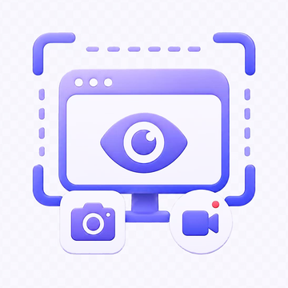

# Screen Guardian



Screen Guardian is a lightweight local screenshot plugin for Codex on Windows.

It is meant to provide compatibility-first capability infrastructure for personal AI.

For Codex, start with `guardian_check` and `guardian_perceive`. Use the older low-level tools only when exact adapter, storage, limit, audio, or envelope control is needed.

For first use, treat it as a local capture fallback: check whether the adapter works, list displays or windows, and save one screenshot. Advanced workflow features are separated into experimental envelope tools that prepare local request files or configuration without forcing a background service.

## AI-first tools

Screen Guardian exposes a broad expert tool surface, but the default MCP surface is intentionally small. AI agents should usually start with the two core intent tools, then enable the advanced surface only when workflow envelopes or reusable commands are needed:

| Need | Tool | What it does |
| --- | --- | --- |
| Check readiness | `guardian_check` | Summarizes runtime, adapters, cache path, capability flags, and the next recommended tool without capturing anything. |
| See or hold local visual context | `guardian_perceive` | Maps quick look, text screenshot, UI debugging, window capture, short change watch, and hold-file requests onto the existing safe capture tools. |
| Prepare workflow envelopes | `guardian_prepare_workflow` | Advanced surface. Writes local model, decision, or monitor request envelopes without calling APIs, subagents, commands, or background schedulers. |
| Discover reusable commands | `guardian_list_commands` | Advanced surface. Lists registered capability commands so the main AI does not need to guess low-level tool combinations. |
| Run a registered command | `guardian_run_command` | Advanced surface. Runs only catalog commands by `command_id`; it does not accept arbitrary code strings. |
| Prepare or run break-glass code | `guardian_prepare_exec`, `guardian_run_exec` | Full surface only. Saves or explicitly runs local Python/PowerShell/Node code. Raw execution is disabled by default and requires `raw_local_exec=true` plus `user_confirmed=true`. |
| Choose a capture route | `list_capture_routes` | Explains desktop, application, webpage, nested-scroll, and guided-chain routes so the AI can pick the right path first. |
| Prepare a capture chain | `prepare_capture_chain` | Writes a local plan for conditional capture, quiet webpage capture, preprocessing, and later model handoff without executing it. |

The normal tools are safe wrappers. They do not bypass feature flags, runtime limits, cache routing, local-only defaults, or the no-hidden-upload/no-hidden-scheduler boundary. The break-glass execution tools are different: they can run local code, but only when visibly enabled and confirmed.

For slow or older systems, capture tools also support timing controls: `delay_seconds` for delayed screenshots, `wait_for_nonblank` for render-complete retries, `render_guard="wait"` for auto-wait-until-rendered capture, `render_guard="warn"` for suspected-unrendered decision options such as force now, capture later, or auto-wait, and `watch_change` for screen transitions or popups.

Program-window capture is quiet-preferred by default. Screen Guardian does not activate or raise the target window; if it must fall back to visible-screen pixels, it probes whether the visible bbox appears to belong to the requested HWND. If another topmost window appears to cover the bbox, the capture is deferred even when `render_guard_confirmed=true`; `allow_unverified_bbox_fallback=true` is the last-resort override.

`guardian_perceive` task `read_text` means "make a text-heavy screenshot easier to inspect." It applies text preprocessing and local image analysis, but the ultra-light core does not bundle OCR; results expose `text_handling.ocr_available=false` unless a future OCR route is added.

See [docs/AI_FIRST_INTERFACE.md](docs/AI_FIRST_INTERFACE.md) for the intuitive task mapping.
See [docs/CAPABILITY_RUNTIME.md](docs/CAPABILITY_RUNTIME.md) for the registered command catalog and break-glass execution model.
See [docs/CAPTURE_GUARDS.md](docs/CAPTURE_GUARDS.md) for optional capture-quality checks and decision menus.
See [docs/WEBPAGE_CAPTURE.md](docs/WEBPAGE_CAPTURE.md) for optional full-page webpage long screenshots through Playwright/CDP-style browser capture.
See [docs/CAPTURE_ROUTES_AND_CHAINS.md](docs/CAPTURE_ROUTES_AND_CHAINS.md) for capture routes, desktop/application/webpage route selection, `nested_scroll` capture, quiet capture, and `prepare_capture_chain` guided plans.
See [docs/RELATED_PROJECTS.md](docs/RELATED_PROJECTS.md) for related product/project research and borrowed design patterns.

Screen Guardian is for authorized perception, accessibility, visibility auditing, debugging, and personal AI assistance. It is not designed or supported for bypassing authentication, paywalls, CAPTCHA, DRM, access controls, platform rules, privacy expectations, or other authorization boundaries. See [docs/ANTI_ABUSE.md](docs/ANTI_ABUSE.md) for the project stance and disclaimer.

## Purpose

Screen Guardian is not only a screenshot helper. Its broader goal is to help users reach positive freedom with AI: more practical capability, more ways for their AI to perceive local work, and more room to build personal workflows.

At the same time, it should not reduce negative freedom. Users should not have to upgrade Windows, replace their environment, accept heavy background services, or install a long chain of dependencies just to give their AI basic visual access.

The project is guided by four principles:

- Expand user agency by giving personal AI more useful local capabilities.
- Preserve user control through local-only defaults and explicit capture actions.
- Prefer compatibility paths that work on older or constrained systems.
- Keep dependencies light, optional, and explainable.

## Why this exists

The first real use case came from an older Windows system where a native Computer Use screenshot path was limited by OS-level capture API support. The AI could still read some accessibility text, but native screenshots failed, so the whole visual workflow became fragile.

Screen Guardian treats that as the design problem: AI capability should not depend on one perfect system path. When a native interface, OS version, driver, or dependency is unavailable, the user should get a fallback path instead of losing the feature entirely.

## Concrete use cases

Screen Guardian is useful when a personal AI needs local sensory access, but the user's system, dependencies, context budget, or privacy expectations make one perfect capture path unrealistic. Its concrete uses fall into five practical groups.

### Restore visual access on constrained systems

- Older Windows builds where native screen capture APIs are unavailable or partially unsupported.
- Machines that cannot be upgraded just to satisfy one AI tool's capture backend.
- Users who want AI visual access without accepting a heavy always-on screen recording service.

### Control context, storage, and preprocessing

- Agents that need lower-resolution screenshots to understand a UI while keeping context and storage small.
- Text-heavy screenshots that should be sharpened, downscaled, tagged, or held as files before entering AI context.
- Users who want limits, storage paths, model settings, or workflow stages to be configurable instead of hard-coded.

### Observe projects when timing matters

- Short workflow observation where a program or region should be captured immediately when it changes.
- Delayed or render-aware capture when a program window exists before its contents finish drawing, causing blank frames on slower systems.
- Quiet browser-rendered capture where a webpage can be captured from an explicit URL without bringing a browser window to the desktop foreground.
- Nested webpage capture where a table, embedded panel, or iframe needs a complete long image instead of only the visible slice.
- Project monitoring where a webpage, program window, region, audio stream, video file, or custom target should trigger capture when a configured feature appears.
- Error-aware workflows where a program, parser, or model can mark an error feature and request a screenshot, audio clip, model request, or follow-up decision.

### Extend into audio, video, and model narration

- Audio debugging: checking whether sound is actually being emitted, whether an external speaker path is likely silent, or whether a program sound effect was produced.
- Recording short explanations, lecture/video audio, or test-program sound effects for later transcription or narration.
- Extracting an audio track from a video before sending it to an audio or transcription route.
- Future OCR, video, or continuous-capture workflows that need bounded, optional dependencies instead of mandatory heavy installs.

### Keep the system adaptable

- Developers who want to swap capture backends without rewriting the whole MCP tool surface.
- Users who want one plugin where optional features can stay inactive without slowing the active capture path.
- Advanced routing where a decision can be a simple table, scoring function, external API, Codex subagent, local command bridge, or prepared request file.

Together, these use cases define Screen Guardian as compatibility infrastructure rather than a heavy recorder. It helps the AI capture what matters, mark why it matters, route it to the right workflow, and keep heavier OCR, audio, video, model, or scheduler paths optional.

## Compatibility adapter model

Screen Guardian now exposes a small adapter surface through `list_adapters`. The current adapter is `python-mss`, selected through `adapter="auto"` by default.

The contract is intentionally simple:

- Probe available adapters before assuming a capture path works.
- Keep MCP tool inputs stable even when the backend changes.
- Return normalized result fields such as `adapter`, `path`, `display`, `capture_box`, and `saved_size`.
- Prefer lightweight fallbacks first, and make heavier dependencies optional.
- Report missing dependencies with install hints instead of failing silently.

See [docs/COMPATIBILITY.md](docs/COMPATIBILITY.md) for the planned dependency-compromise interface.

## Naming profile

Screen Guardian can keep its display identity flexible:

- `get_display_profile` reports the active name, detected system language, and current Codex manifest name.
- `set_display_name` switches between `auto` mode and `manual` mode.
- `auto` mode chooses a localized name for the detected locale.
- `manual` mode stores a local alias under the user's app data folder, not in the public repository.
- `apply_display_profile` writes the active name into the local plugin manifest when the user wants the Codex plugin card to use it.

Codex reads plugin card metadata from the manifest, so a manifest-applied rename requires a plugin reload or reinstall before the UI shows the new name.

See [docs/NAMING.md](docs/NAMING.md) for details.

## Capability activation

Screen Guardian no longer needs separate lightweight/practical/heavy plugin variants. It is one compatibility-first plugin with optional capability flags.

Inactive features should avoid optional work: no polling loop, no extra mirror copy, no heuristic image analysis, no preprocessing, no audio-device probe, no recording, no FFmpeg extraction, no OCR bridge, no external API request, and no subagent handoff unless the user enables or explicitly calls that path.

Decision policies and monitor profiles are configuration and envelope interfaces. They can express complex logic, but Screen Guardian does not execute arbitrary decision code or install a background scheduler by default.

See [docs/MODELS.md](docs/MODELS.md) for the activation model in more detail.

## Tool layers

New users and AI agents should start with `guardian_check` and `guardian_perceive`. By default, the MCP server exposes only the core tool surface so first use stays small. Set `SCREEN_GUARDIAN_TOOL_SURFACE=advanced` or `SCREEN_GUARDIAN_TOOL_SURFACE=full` before starting the MCP server to expose advanced workflow, media, and lab tools. The MCP `tools/list` result includes `toolSurface` with the active value: `core`, `advanced`, or `full`.

### Core tools

These are the first-use tools. They perform explicit local checks or captures and save files locally by default:

| Need | Tools |
| --- | --- |
| Use the default AI facade | `guardian_check`, `guardian_perceive` |
| Check whether Screen Guardian can run | `check_dependencies`, `list_adapters` |
| See available screens and windows | `list_displays`, `list_windows` |
| Save a screenshot | `capture_screen`, `capture_region`, `capture_window` |
| Choose a capture route | `list_capture_routes` |
| Catch a short visible change | `watch_screen` |
| Remove local Screen Guardian files | `clear_cache` |

Core capture outputs can be downscaled, saved as PNG/JPG, and tagged with project or workflow metadata when those options are enabled.

### Local control tools

These tools tune local behavior without starting background work or calling external services. They are hidden from default `tools/list` unless `SCREEN_GUARDIAN_TOOL_SURFACE=advanced` or `full` is set:

- `get_runtime_settings`, `set_feature_flags`, `set_runtime_limits`
- `set_cache_path`, `set_storage_routes`
- `analyze_image`, `preprocess_image`
- `get_display_profile`, `set_display_name`, `apply_display_profile`
- `list_audio_devices`, `record_audio`, `analyze_audio`, `extract_audio_track`

Audio and video-audio extraction stay optional. They require explicit feature activation and user intent.

### Experimental envelope tools

These tools are advanced workflow interfaces. They store configuration or write local request envelopes for another caller, bridge, scheduler, future adapter, or subagent. They are hidden from the default core surface:

- `list_extension_routes`, `set_extension_route`, `prepare_model_request`
- `list_decision_policies`, `set_decision_policy`, `prepare_decision_request`
- `list_monitor_profiles`, `set_monitor_profile`, `prepare_monitor_tick`
- `prepare_capture_chain`

Experimental envelope tools do not execute arbitrary decision code, call APIs, invoke subagents, upload files, record media, or start monitoring by themselves.

Break-glass local execution tools are lab tools. They are exposed only on the `full` surface and still require the persistent `raw_local_exec` feature flag plus per-call confirmation.

Captures are saved locally by default:

```text
~/Pictures/ScreenGuardian
```

See [docs/WORKFLOWS.md](docs/WORKFLOWS.md) for the same core/local-control/experimental-envelope split with cache, feature flags, project/workflow markers, runtime limits, multi-route saves, model request envelopes, decision policies, monitor profiles, preprocessing, and bounded watch details.

## Volcengine Ark experiments

`scripts/volcengine_ark_runner.py` is an optional external API bridge for real Ark experiments. It can consume a Screen Guardian model-request envelope or a direct image, video, or audio file. It only calls Ark when you run it and provide an API key through an environment variable.

```powershell
$env:ARK_API_KEY = "your-ark-api-key"
$env:ARK_MODEL = "your-model-id"
$zhImagePrompt = [System.Text.RegularExpressions.Regex]::Unescape('\u8bf7\u7528\u4e2d\u6587\u7b80\u6d01\u63cf\u8ff0\u8fd9\u4e2a\u622a\u56fe\u4e2d\u5bf9\u6392\u67e5\u95ee\u9898\u6700\u91cd\u8981\u7684\u4fe1\u606f\u3002')

python .\scripts\volcengine_ark_runner.py `
  --dry-run `
  --path "C:\path\to\capture.jpg" `
  --media-kind image `
  --detail low `
  --thinking disabled `
  --max-tokens 300 `
  --prompt $zhImagePrompt
```

The prompt variable is decoded from `\u` escapes so README command examples stay ASCII-only across GitHub copy, Windows terminals, npm wrappers, and editor encodings. Direct localized prompts are fine when the terminal and file encoding are known-good UTF-8.

Real runs write redacted request artifacts, responses, summaries, and a JSONL usage ledger under `~/Pictures/ScreenGuardian/ArkRuns` by default.

See [docs/VOLCENGINE_EXPERIMENTS.md](docs/VOLCENGINE_EXPERIMENTS.md) for the quota-aware workflow.

## Dependencies

The first version uses Python with:

- `mss`
- `Pillow`

Install them with:

```powershell
python -m pip install --user -r scripts/requirements.txt
```

The MCP server itself uses Node.js and has no npm dependencies.

For predictable MCP runtime discovery, set `SCREEN_GUARDIAN_PYTHON` to the Python executable you want Screen Guardian to use:

```powershell
$env:SCREEN_GUARDIAN_PYTHON = "C:\Path\To\python.exe"
```

This is preferred over npm's legacy `python` config. If `npm run ...` prints `npm warn Unknown env config "python"`, the warning is from npm configuration and does not mean Screen Guardian failed when the script exits successfully.

For the most stable path on constrained systems, build a self-contained helper executable:

```powershell
npm run build:helper
$env:SCREEN_GUARDIAN_HELPER_EXE = "$PWD\bin\screen-guardian-helper.exe"
```

When `SCREEN_GUARDIAN_HELPER_EXE` or `bin/screen-guardian-helper.exe` is available, the MCP server uses that helper before looking for Python. The server can also recover from stale plugin cache paths by checking `SCREEN_GUARDIAN_CAPTURE_SCRIPT`, the source plugin folder, and newer sibling cache folders for `screen_guardian_capture.py`.

Optional audio recording uses:

```powershell
python -m pip install --user -r scripts/optional-audio-requirements.txt
```

Video audio extraction requires FFmpeg on `PATH`.

## Local test

You can smoke-test the MCP server with newline-delimited JSON-RPC:

```powershell
@'
{"jsonrpc":"2.0","id":1,"method":"initialize","params":{"protocolVersion":"2024-11-05"}}
{"jsonrpc":"2.0","id":2,"method":"tools/call","params":{"name":"check_dependencies","arguments":{}}}
{"jsonrpc":"2.0","id":3,"method":"tools/call","params":{"name":"list_displays","arguments":{}}}
{"jsonrpc":"2.0","id":4,"method":"tools/call","params":{"name":"list_windows","arguments":{"limit":5}}}
'@ | node .\mcp\server.cjs
```

## Validation

Run static contract validation:

```powershell
npm run check:encoding
python scripts/validate_contracts.py
```

Run the bounded MCP stress test:

```powershell
python scripts/validate_contracts.py --stress
```

The stress runner uses an isolated temporary `APPDATA` and `SCREEN_GUARDIAN_TOOL_SURFACE=full`, so temporary `sg-stress-*` policies and profiles cannot leak into the user's normal Screen Guardian config.

For reliable direct CLI calls on Windows PowerShell, prefer stdin instead of passing JSON through argv quoting:

```powershell
@'
{"action":"list_windows","args":{"limit":5}}
'@ | python .\scripts\screen_guardian_capture.py --stdin
```

See [docs/VALIDATION.md](docs/VALIDATION.md) for what these checks prove and what they intentionally leave to future adapters.

Run the Windows smoke test on a local Windows machine:

```powershell
npm run smoke:windows
```

## Privacy model

This version still avoids background services, recording, bundled OCR, cloud upload, and screen history. It can run bounded change-triggered capture, but only as an explicit foreground request. Monitor profiles describe periodic or feature-triggered work for a caller, scheduler, future adapter, or subagent; they do not silently start a monitor or scheduler. Bounds are configurable because the project treats limits as policy, not permanent product walls.

## Upgrade path

The next version can add:

- short FFmpeg recordings
- OCR adapters for text screenshots
- more provider-specific image and video summarization helpers
- stricter privacy filters by app, window, or region
- scheduler adapters that consume monitor tick envelopes with explicit user approval
